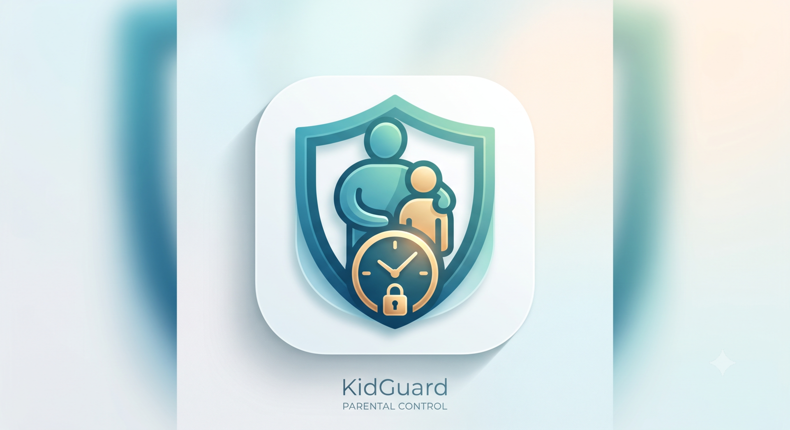
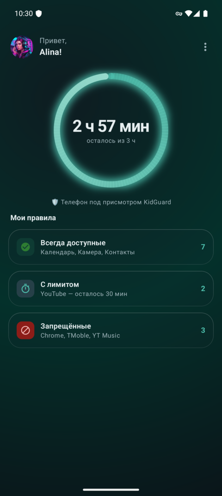
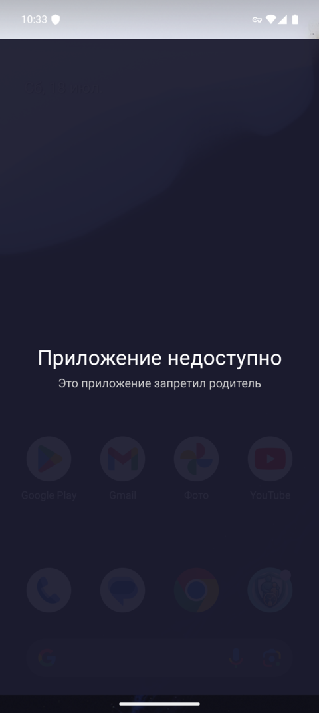
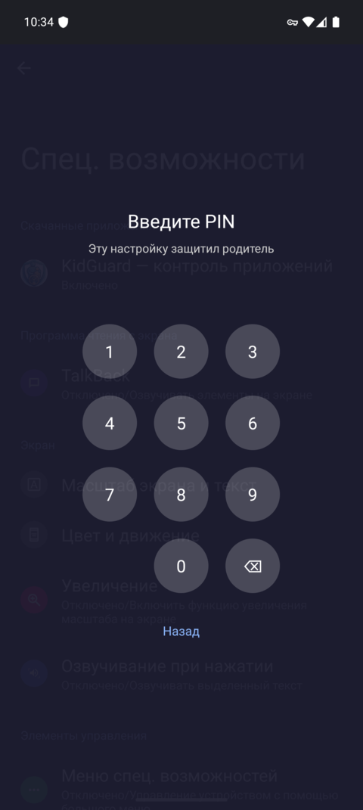
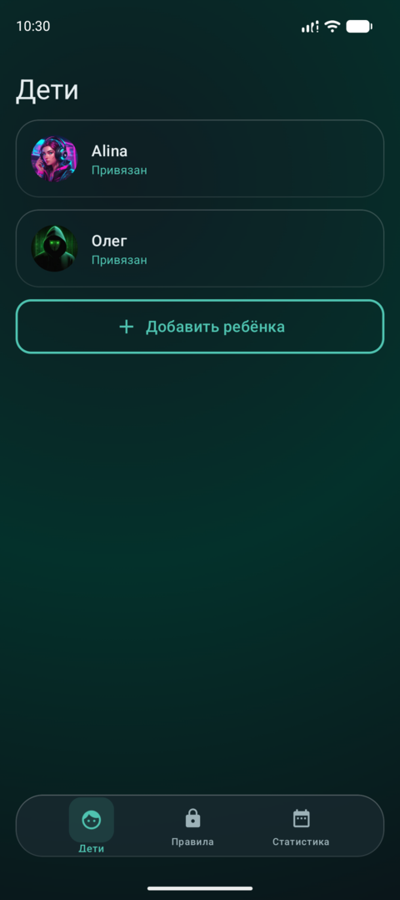
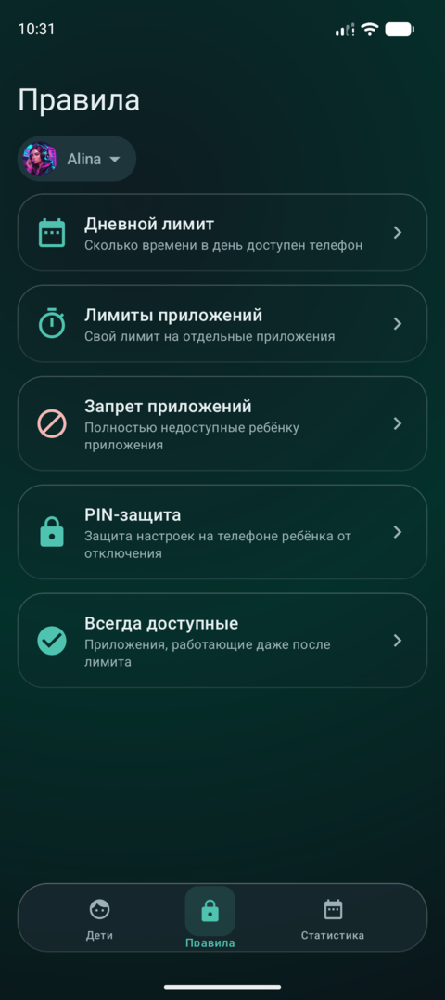
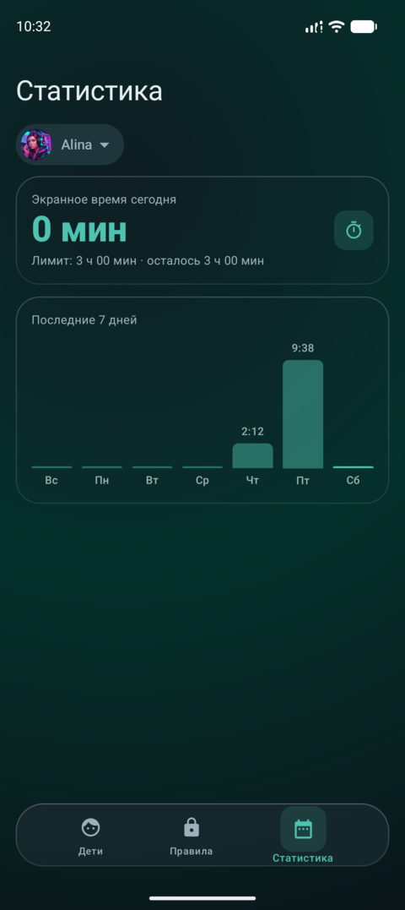

<h1 align="center">KidGuard</h1>

<p align="center">
  Приложение родительского контроля для Android — самостоятельная альтернатива Google Family Link,
  <br>сделанная «под себя»: с точным учётом экранного времени и блокировкой любых приложений, включая системные.
</p>

<p align="center">
  
  
  
  
</p>

---

## Зачем это нужно

Проект вырос из двух претензий к Google Family Link:

1. **Family Link не блокирует системные приложения и Play Market** — после истечения
   разрешённого времени ребёнок всё равно мог ими пользоваться.
2. **Некорректный учёт времени** — Family Link отсчитывает время «от запуска приложения», не
   глядя на экран: даже когда телефон лежит с погашенным экраном (например, играет фоновая
   музыка), разрешённое время продолжает списываться.

KidGuard решает обе проблемы. Учёт списывает **только реальное экранное время** — что подтверждено
замерами на реальном устройстве: при погашенном экране счётчик не растёт вовсе, при активном —
секунда в секунду.

## Скриншоты

### 📱 На телефоне ребёнка

| Сегодня | Блокировка приложения | Защита настроек PIN-ом |
|:---:|:---:|:---:|
|  |  |  |
| Кольцо остатка времени и свод правил | Запрещённое приложение недоступно | Критичные системные экраны под родительским PIN |

### 👨‍👩‍👧 На телефоне родителя

| Дети | Правила | Статистика |
|:---:|:---:|:---:|
|  |  |  |
| Список детей и статус контроля | Лимиты, запреты, белый список, PIN | Экранное время за сегодня и 7 дней |

> Скриншоты сняты с рабочей сборки (тема — тёмная; поддерживается и светлая).

## Ключевые возможности

- 👨‍👩‍👧 **Две роли** — родитель и ребёнок. Роль выбирается один раз при первичной настройке
  и фиксируется навсегда (без повторного входа).
- ⏱️ **Точный учёт реального экранного времени** — время списывается только когда экран
  включён и разблокирован. Фоновые процессы и музыка при погашенном экране время не расходуют.
- 📵 **Блокировка любых приложений** — включая Play Market и системные, которые Family Link
  трогать не умеет.
- 🗓️ **Дневной лимит** экранного времени с настройкой по дням недели.
- 🎯 **Лимиты на отдельные приложения** — своё время на каждое приложение.
- ➕ **Бонусное время** — родитель со своего телефона выдаёт ребёнку дополнительное время
  (на весь телефон или на конкретное приложение).
- ✅ **Белый список «всегда доступных»** — телефон, SMS, контакты и другие приложения по
  выбору родителя остаются доступны даже после истечения лимита, чтобы ребёнок был на связи.
- 🌐 **Блокировка интернета после лимита** — по Wi-Fi и мобильной сети, кроме связи с сервером
  синхронизации.
- 🔄 **Синхронизация между родителями** — оба родителя равноправны и управляют единым набором
  правил ребёнка; изменения одного видит другой.
- 🔒 **Защита от обхода** — критичные системные экраны (настройки Accessibility, VPN,
  «Администраторы устройства», «Дата и время», удаление приложения) закрыты родительским PIN
  с защитой от перебора. Без PIN подросток не отключит контроль и не удалит приложение.
- 🩺 **Самодиагностика контроля** — если на телефоне ребёнка отвалилось разрешение или систему
  выгрузил вендор, родитель видит на своей карточке ребёнка, что именно сломалось (контроль
  умеет умирать молча — эта функция не даёт этому пройти незамеченным).

## Как это устроено

KidGuard состоит из трёх частей: приложения на телефоне ребёнка, приложения на телефонах
родителей и бэкенда для синхронизации.

Правила исполняются **локально** на детском устройстве (хранятся в базе на самом телефоне),
поэтому контроль работает даже без сети — интернет нужен только для получения обновлённых
правил и отправки статистики.

Приложение распространяется установкой `.apk` (не через Google Play) и **не требует** прав
Device Owner, root, компьютера или сброса телефона к заводским настройкам. Весь контроль
строится на штатных механизмах Android, разрешения на которые выдаются в мастере первичной
настройки:

- **Accessibility Service** — определяет активное приложение и блокирует нежелательные
  оверлеем поверх экрана (работает для любых приложений, включая системные). Он же перехватывает
  открытие критичных системных экранов и накрывает их PIN-оверлеем — защита от обхода.
- **VpnService** — локальный VPN для блокировки интернета после лимита.
- **Device Admin** — защита приложения от удаления.
- **Foreground Service** — точный подсчёт реального экранного времени.

Привязка аккаунтов — через **Google Sign-In** (родитель) и **6-значный код привязки** (ребёнок):
родитель добавляет ребёнка и привязывает его устройство одноразовым кодом.

## Технологии

- **Язык:** Kotlin
- **UI:** Jetpack Compose, Material 3 (кастомная glassmorphism дизайн-система, светлая/тёмная темы)
- **Архитектура:** Clean Architecture + MVVM; многомодульная сборка (`:app` / `:core` / `:data` / `:platform`)
- **Асинхронность:** Coroutines + Flow
- **DI:** Hilt
- **Локальные данные:** Room
- **Сеть:** Retrofit + OkHttp, WebSocket (push-обновления политики)
- **Аутентификация:** Google Sign-In (Credential Manager)
- **Бэкенд:** Node.js (Express) + SQLite; сервер policy-agnostic (хранит непрозрачный JSON-документ политики)
- **Сборка:** Gradle (Kotlin DSL, version catalog); minSdk 33, target/compileSdk 36

## Статус

Все запланированные вехи (1–6) реализованы и влиты в `main`. Приложение прошло обкатку на
реальном детском устройстве (Tecno Spark 30 Pro, HiOS) и находится в **полевом тестировании** —
реальной эксплуатации в семье. Дальше — сбор обратной связи и точечные доработки.

## Сборка

```bash
git clone https://github.com/Cha1000000/KidGuard.git
cd KidGuard
./gradlew assembleDebug
```

Для сборки нужен Android SDK (путь указывается в `local.properties`) и JDK 17+.

## Дисклеймер

KidGuard — личный проект для семейного использования, не связанный с Google и Family Link.
Приложение предназначено для контроля устройств собственных несовершеннолетних детей
родителями. Автор не несёт ответственности за использование не по назначению.

## Автор

Владимир ([@Cha1000000](https://github.com/Cha1000000)) — Android-разработчик.
