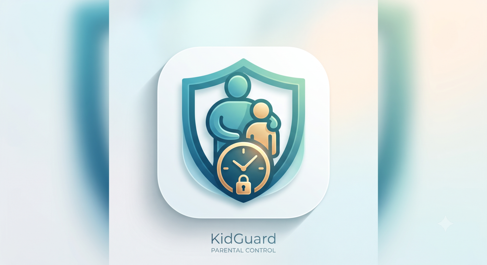
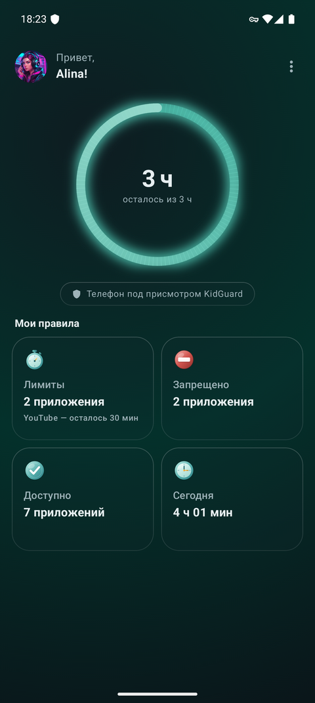
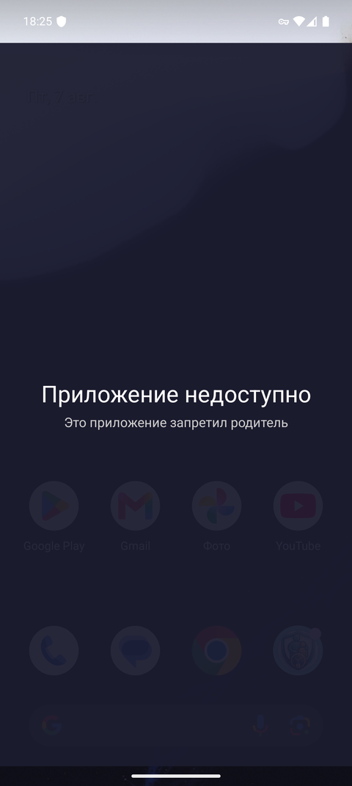
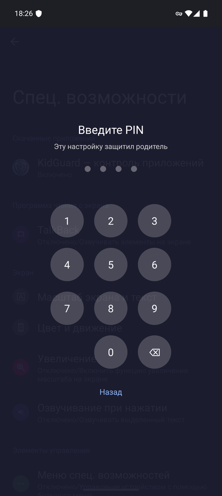
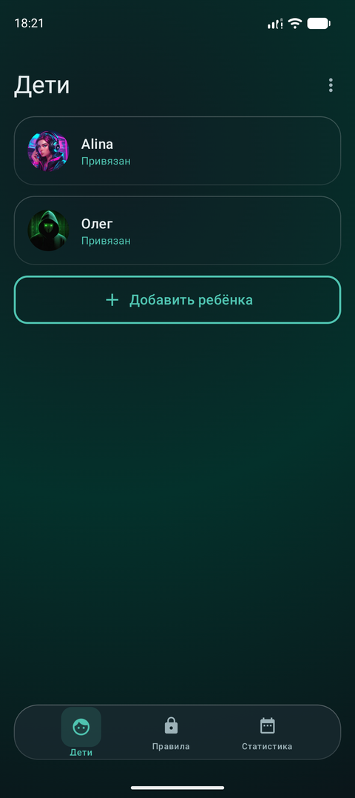
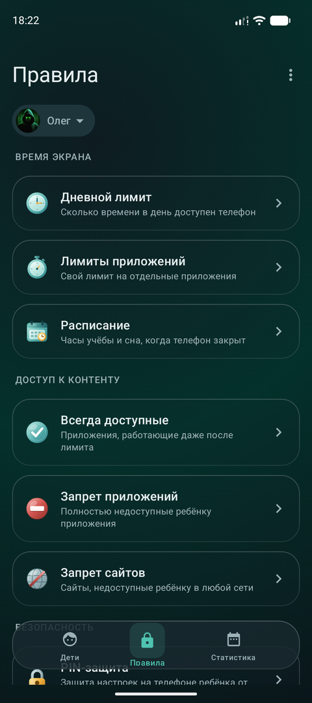
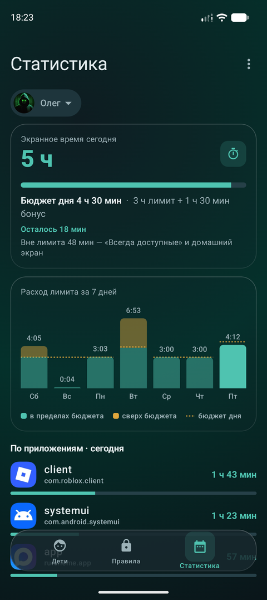

<h1 align="center">KidGuard</h1>

<p align="center">
  Приложение родительского контроля для Android — самостоятельная альтернатива Google Family Link,
  <br>сделанная «под себя»: с точным учётом экранного времени и блокировкой любых приложений, включая системные.
</p>

<p align="center">
  
  
  
  
</p>

---

## Зачем это нужно

Проект вырос из двух претензий к Google Family Link:

1. **Family Link не блокирует системные приложения и Play Market** — после истечения
   разрешённого времени ребёнок всё равно мог ими пользоваться.
2. **Некорректный учёт времени** — Family Link отсчитывает время «от запуска приложения», не
   глядя на экран: даже когда телефон лежит с погашенным экраном (например, играет фоновая
   музыка), разрешённое время продолжает списываться.

KidGuard решает обе проблемы. Учёт списывает **только реальное экранное время** — что подтверждено
замерами на реальном устройстве: при погашенном экране счётчик не растёт вовсе, при активном —
секунда в секунду.

## Скриншоты

### 📱 На телефоне ребёнка

| Сегодня | Блокировка приложения | Защита настроек PIN-ом |
|:---:|:---:|:---:|
|  |  |  |
| Кольцо остатка времени и свод правил | Запрещённое приложение недоступно | Критичные системные экраны под родительским PIN |

### 👨‍👩‍👧 На телефоне родителя

| Дети | Правила | Статистика |
|:---:|:---:|:---:|
|  |  |  |
| Список детей и статус контроля | Лимиты, запреты, белый список, PIN | Экранное время за сегодня и 7 дней |

> Скриншоты сняты с рабочей сборки (тема — тёмная; поддерживается и светлая).

## Ключевые возможности

- 👨‍👩‍👧 **Две роли** — родитель и ребёнок. Роль выбирается один раз при первичной настройке
  и фиксируется навсегда (без повторного входа).
- ⏱️ **Точный учёт реального экранного времени** — время списывается только когда экран
  включён и разблокирован. Фоновые процессы и музыка при погашенном экране время не расходуют.
- 📵 **Блокировка любых приложений** — включая Play Market и системные, которые Family Link
  трогать не умеет.
- 🗓️ **Дневной лимит** экранного времени с настройкой по дням недели.
- 🎯 **Лимиты на отдельные приложения** — своё время на каждое приложение.
- ➕ **Бонусное время** — родитель со своего телефона выдаёт ребёнку дополнительное время
  (на весь телефон или на конкретное приложение); выданное действует сразу и не гасится тем,
  что ребёнок успел «накрутить» после истечения лимита.
- ➖ **Штрафы** — обратная сторона бонусов: родитель снимает время с оставшегося дневного лимита
  и может пояснить, за что; пояснение видит ребёнок на своём экране. Назначенный штраф
  отменяется одной кнопкой.
- ✅ **Белый список «всегда доступных»** — телефон, SMS, контакты и другие приложения по
  выбору родителя остаются доступны даже после истечения лимита, чтобы ребёнок был на связи;
  время в них не расходует дневной лимит.
- 🌐 **Запрет сайтов** — блокировка отдельных доменов на уровне DNS, независимо от дневного
  лимита; отдельный тумблер отключает поиск Google целиком (обход через веб-поиск).
- 🌙 **Расписание** — «Время учёбы» (мягкая блокировка, разрешённые приложения работают) и
  «Время сна» (полная блокировка телефона, снимается только PIN-ом родителя; с замка доступен
  экстренный звонок по номеру из списка родителя).
- ☕ **Перерывы** — принудительная пауза при непрерывном использовании телефона дольше
  заданного времени.
- ⏳ **Досчёт пропущенного времени** — если контроль всё-таки остановили, время, проведённое в
  телефоне без него, не теряется: при следующем запуске оно берётся из системной статистики
  использования (её Android ведёт сам) и списывается с лимита задним числом. Останавливать
  приложение ради лишнего времени становится бессмысленно.
- 📊 **Статистика с бюджетом дня** — экранное время за сегодня и за неделю; отдельно видно
  расход в пределах дневного бюджета (лимит + бонус) и перерасход сверх него.
- 🌐 **Блокировка интернета после лимита** — по Wi-Fi и мобильной сети, кроме связи с сервером
  синхронизации.
- 🔄 **Синхронизация между родителями** — оба родителя равноправны и управляют единым набором
  правил ребёнка; изменения одного видит другой.
- 🔒 **Защита от обхода** — критичные системные экраны (настройки Accessibility, VPN,
  «Администраторы устройства», «Дата и время», удаление приложения) закрыты родительским PIN
  с защитой от перебора. Под тем же PIN и **список последних приложений**: именно оттуда кнопка
  «Очистить всё» останавливала контроль. Родитель список открывает и разбирает как обычно, а
  ребёнок — нет. Тот же PIN снимает любой блокирующий оверлей, если телефон понадобился взрослому.
- 🩺 **Сторож контроля** — если на телефоне ребёнка пропало разрешение «Специальные
  возможности» (контроль умеет умирать молча — выключением одного тумблера или принудительной
  остановкой приложения), родитель узнаёт об этом уведомлением на своём телефоне, а телефон
  ребёнка через 5 минут без восстановления закрывается замком. Если разрешение выдано
  доверенным способом с компьютера, оно чинится само.
  Молчание телефона ребёнка замечается **за 40 минут**, причём независимо от того, запущено ли
  родительское приложение: сервер проверяет это сам и дублирует тревогу письмом. Ночью не будит.
  В карточке здоровья видно и **причину**, по которой контроль пропал в прошлый раз — приложение
  спрашивает её у системы.
- 🔔 **Настройка оповещений** — по каждому ребёнку отдельно выбирается, каким каналом звать
  родителя: уведомлением в шторку, письмом или обоими. Настройка личная: у ребёнка может быть
  двое родителей, и отписка одного не влияет на второго. Письма можно перенаправить на другой
  адрес, отличный от гугловского, — при сохранении на него уходит проверочное письмо, чтобы
  опечатка не обернулась молчанием.
- 👤 **Управление аккаунтом** — выход и удаление учётной записи родителя прямо в приложении,
  без обращения в поддержку.

## Как это устроено

KidGuard состоит из трёх частей: приложения на телефоне ребёнка, приложения на телефонах
родителей и бэкенда для синхронизации.

Правила исполняются **локально** на детском устройстве (хранятся в базе на самом телефоне),
поэтому контроль работает даже без сети — интернет нужен только для получения обновлённых
правил и отправки статистики.

Приложение распространяется установкой `.apk` (не через Google Play) и **не требует** прав
Device Owner, root, компьютера или сброса телефона к заводским настройкам. Весь контроль
строится на штатных механизмах Android, разрешения на которые выдаются в мастере первичной
настройки:

- **Accessibility Service** — определяет активное приложение и блокирует нежелательные
  оверлеем поверх экрана (работает для любых приложений, включая системные). Он же перехватывает
  открытие критичных системных экранов и накрывает их PIN-оверлеем — защита от обхода.
- **VpnService** — локальный VPN для блокировки интернета после лимита и запрета сайтов.
- **Device Admin** — защита приложения от удаления.
- **Foreground Service** — точный подсчёт реального экранного времени.
- **Доступ к данным использования** — системная статистика, по которой досчитывается время, если
  контроль был остановлен. Разрешение необязательное: без него работает всё, кроме досчёта.

Это же разрешение Accessibility Service — единственная точка, от которой зависит весь контроль,
поэтому её пропажа отслеживается отдельно, причём с трёх сторон: фоновый сторож на детском
устройстве реагирует на исчезновение разрешения замком; родитель получает уведомление на своём
телефоне без push-сервиса (WorkManager + WebSocket-сигнал с сервера); а если контроль убит целиком
и доложить о себе не может, молчание замечает сам сервер и пишет родителю письмо.

Уведомление родителю приходит от его собственного приложения, которое просыпается по расписанию.
На оболочках, охотно чистящих фон (HiOS и подобные), это работает не всегда: после принудительной
остановки приложения фоновая проверка не возобновляется, пока его не откроют. Поэтому серверное
письмо — не дубль ради надёжности, а единственный канал, который от этого не зависит.

Привязка аккаунтов — через **Google Sign-In** (родитель) и **6-значный код привязки** (ребёнок):
родитель добавляет ребёнка и привязывает его устройство одноразовым кодом.

## Технологии

- **Язык:** Kotlin 2.4
- **UI:** Jetpack Compose, Material 3 (кастомная glassmorphism дизайн-система, светлая/тёмная темы)
- **Архитектура:** Clean Architecture + MVVM; многомодульная сборка (`:app` / `:core` / `:data` / `:platform`)
- **Асинхронность:** Coroutines + Flow
- **DI:** Hilt
- **Локальные данные:** Room
- **Сеть:** Retrofit + OkHttp, WebSocket (push-обновления политики)
- **Аутентификация:** Google Sign-In (Credential Manager)
- **Бэкенд:** Node.js (Express) + SQLite; сервер policy-agnostic (хранит непрозрачный JSON-документ политики)
- **Сборка:** Gradle 9.7 (Kotlin DSL, version catalog), AGP 9.4; minSdk 33, target/compileSdk 36

## Статус

Все запланированные вехи (1–6) реализованы и влиты в `main`. Приложение работает на реальном
детском устройстве (Tecno Spark 30 Pro, HiOS) и находится в ежедневной эксплуатации в семье —
там же и проверяется: подросток исправно ищет обходные пути, и каждый найденный превращается в
задачу. Так появились защита списка последних приложений, досчёт пропущенного времени и серверный
сторож молчания.

К публикации в RuStore готово почти всё: релизная подпись, политика конфиденциальности и
пользовательское соглашение (GitHub Pages), Google OAuth в Production. Осталась карточка
приложения в магазине.

## Сборка

```bash
git clone https://github.com/Cha1000000/KidGuard.git
cd KidGuard
./gradlew assembleDebug
```

Для сборки нужен Android SDK (путь указывается в `local.properties`) и JDK 17+.

## Дисклеймер

KidGuard — личный проект для семейного использования, не связанный с Google и Family Link.
Приложение предназначено для контроля устройств собственных несовершеннолетних детей
родителями. Автор не несёт ответственности за использование не по назначению.

## Автор

Владимир ([@Cha1000000](https://github.com/Cha1000000)) — Android-разработчик.
